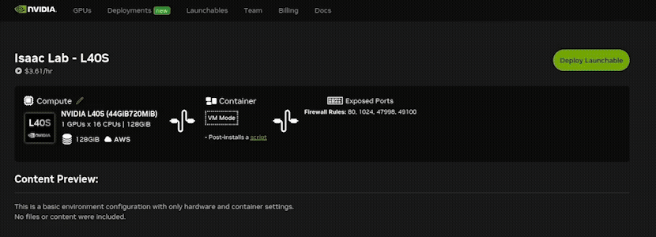

# Isaac Launchable

> Fork of [isaac-sim/isaac-launchable](https://github.com/isaac-sim/isaac-launchable), trimmed to Isaac Sim only
> (no Isaac Lab, no VS Code container) plus an `asset-sync` sidecar that mirrors a workr-studio project's
> assets into `isaac-sim/scenes`. The mirroring is done by the `@workr-labs/sync` CLI; see
> `isaac-sim/.env.example` for the credentials it needs and `isaac-sim/asset-sync/run.sh` for the
> cycle it runs on.

Isaac Launchable offers a simplified approach to trying [Isaac Sim](https://github.com/isaac-sim/IsaacSim) in a web browser.

Through this project, users interact with Isaac Sim purely from a web browser tab providing the streamed user interface.

Launchables are provided by [NVIDIA Brev](https://developer.nvidia.com/brev), using this repo as a template. Launchables are preconfigured, fully optimized compute and software environments. They allow users to start projects without extensive setup or configuration.

## What this project contains
The installation steps for Isaac Lab are automated via Docker, such that it can be used locally, or be deployed on services such as NVIDIA Brev and run with cloud resources.

The project includes:
- Isaac Sim 6.0.1 container
- an Omniverse Kit App Streaming client, based on the [web-viewer-sample](https://github.com/NVIDIA-Omniverse/web-viewer-sample) project
- an `asset-sync` sidecar mirroring a workr-studio project's assets


## Quickstart Guide
This fork has no public Deploy button (it deploys your bucket's credentials, not something to hand out) — go straight to "Creating Your Own Launchable" below, then come back here for how to run Isaac Sim once it's up.

> [!IMPORTANT]
> This project is intended for learning purposes. It is not intended for production use.

> [!NOTE]
> Please note that Brev instances are pay-by-the-hour. To make the best use of credits, stop instances when they are not in use. Stopped instances have a smaller storage charge.

## Running Isaac Sim

1. Wait for the instance to be fully ready on Brev: running, built, and the setup script has completed (the first launch can take a while).
2. Open the instance's port-80 Secure Link in Chrome or Edge and append `/viewer` to it. Brev asks you to sign in with an NVIDIA account; use an email the Secure Link grants access to (see step 11 of "Creating Your Own Launchable").
- Example: `https://isaac-xxxxxxxx.gobrev.dev/viewer`
- The bare link without `/viewer` isn't served: nginx proxies `/` to port 8080, where upstream's VS Code container ran, and this fork has none.
3. On subsequent relaunches, simply refresh the viewer tab to see the UI.
4. Assets mirrored from the project are under **Workr Studio → Library** in the Isaac Sim Content browser, next to Isaac Sim and Omniverse. The same folder is also at `/WORKR_STUDIO/library` under My Computer. The Workr Studio entry comes from a small Kit extension in `isaac-sim/exts/workr.content_browser`. That directory is a view over the mirror in `/WORKR_STUDIO/.assets`, rebuilt after each sync and holding only openable scene files — renditions like thumbnails stay in the mirror and out of the browser. Nothing should be written into `/WORKR_STUDIO/.assets`: the sync CLI removes what it no longer sees upstream, and anything else there survives only by accident. This is pull-only: nothing saved locally is pushed back to workr-studio (see `isaac-sim/docker-compose.yml`'s `asset-sync` service and `isaac-sim/asset-sync/run.sh`).

> [!IMPORTANT]
> This setup is only intended to be used with one viewer instance. Please only keep one viewer tab open at a time for best results.

## Creating Your Own Launchable

If you'd like a Launchable with more compute, or other custom features, you can fork this repo and / or use this repo but configure a custom Launchable for your projects.

#### Configuring a Custom Brev Launchable

These instructions describe how to create a customized Launchable, similar to the one linked at the beginning of this guide.

1. Log in to the [Brev](https://login.brev.nvidia.com/signin) website.
2. Go to the Launchables category.
3. Click the **Create Launchable** button.
4. Set the Launchable's code source to your fork's GitHub URL. (Choosing "I don't have any code files" also works: the setup script below clones the repo if Brev hasn't.)
5. Choose **VM Mode - Basic VM with Python installed**, then click Next. Container mode won't work: the stack needs Docker Compose with host networking and the NVIDIA runtime.
6. Add `WORKR_TOKEN`, `PROJECT_ID` and `SYNC_VERSION` as the Launchable's environment variables (see `isaac-sim/.env.example` for what each one is). To find the project id, run `WORKR_TOKEN=<token> npx @workr-labs/sync projects` anywhere with node installed.
7. Add a setup script. Under the *Paste Script* tab, add this code (replace the repo URL with your fork):
```bash
#!/bin/bash
set -euo pipefail

: "${WORKR_TOKEN:?not set - check Brev env variables}"
: "${PROJECT_ID:?not set - check Brev env variables}"
: "${SYNC_VERSION:?not set - check Brev env variables}"

REPO_DIR=/home/ubuntu/workr-isaac-sim
[ -d "$REPO_DIR" ] || git clone https://github.com/your-org/workr-isaac-sim "$REPO_DIR"
chown -R ubuntu:ubuntu "$REPO_DIR"
cd "$REPO_DIR/isaac-sim"

# Brev's env variables reach this script but not a later SSH or
# `brev shell` session; Compose reads .env from any shell.
( umask 077
  printf "WORKR_TOKEN='%s'\nPROJECT_ID='%s'\nSYNC_VERSION='%s'\n" \
    "$WORKR_TOKEN" "$PROJECT_ID" "$SYNC_VERSION" > .env )

docker compose up -d
```
Brev runs this script as a systemd service, not from your home directory, so the paths must be absolute: a relative `cd workr-isaac-sim/isaac-sim` fails. The checks at the top stop the script with a clear message in its log if the environment variables didn't reach it. Without them, Compose would substitute blanks and `asset-sync` would restart in a loop. `REPO_DIR` must match where the code source clones to; otherwise the script clones and runs a second copy.

The script also copies the three values into `isaac-sim/.env`, readable only by `ubuntu`. Brev's environment variables are only available to this script, not to a terminal you open on the instance later. Without `.env`, running `docker compose up -d` by hand would recreate `asset-sync` with a blank token. The values are single-quoted so Compose doesn't expand a `$` inside them. The file is gitignored.
8. This fork has no VS Code container, so there's no landing-page password to set. The Secure Links feature (step 11) is what gates access.
9. Click Next.
10. Under "Do you want a Jupyter Notebook experience" select "No, I don't want Jupyter".
11. Select the Secure Link tab, and add a secure link named "isaac" at port 80. Grant access to the exact NVIDIA-account email of everyone who will open the viewer. Any other address is refused, even another one belonging to the same person.
12. Select the TCP/UDP ports tab.
13. Add rules to open the following ports for streaming (the video goes straight to the instance's IP over these, not through the Secure Link):
```
1024
47998
49100
```
14. Click Next.
15. Choose your desired compute.

> [!NOTE]
> GPUs with RT cores are required for Kit App Streaming, e.g. L4, L40S, A10G or RTX cards. A100 and H100 have no RT cores and won't stream.
> The compute specs and driver versions provided also need to be compatible with [Isaac Sim](https://docs.isaacsim.omniverse.nvidia.com/latest/installation/requirements.html). The available drivers are not exposed on this Brev page currently.

> [!IMPORTANT]
> The project is not currently compatible with Crusoe instances. AWS has been tested and is used for the example launchable.
16. Choose disk storage, then click Next.
17. Enter a name, then select **Create Launchable**

Congratulations! You now have a custom launchable.

## Using This Project Locally

This project can also be used to run a containerized version of Isaac Sim.

To use this project locally, you'll need a workstation that meets [Isaac Sim](https://docs.isaacsim.omniverse.nvidia.com/latest/installation/requirements.html)'s requirements.

1. Install the NVIDIA Container Toolkit: `sudo apt install nvidia-container-toolkit`
2. In `isaac-sim/docker-compose.yml`, change the `ENV=brev` line to `ENV=localhost`.
3. Copy `isaac-sim/.env.example` to `isaac-sim/.env` and fill in the service-account bearer token.
4. Inside the folder `isaac-sim`, run `docker compose up -d`.
5. Access the viewer at `localhost/viewer` in a browser.

## Troubleshooting

**NVIDIA-branded "403 Forbidden" page.** This is Brev's Secure Link access check, not the containers. The request never reached the instance. The browser is signed in with an NVIDIA account the link doesn't allow. If you have more than one NVIDIA account, Chrome may sign in with the wrong one automatically. Open the link in an Incognito window and sign in with the email the link grants access to, or add your email to the link's access list.

**Setup script failed.** The instance's setup-script log shows the first command that failed. `cd: ... No such file or directory` means the repo isn't at `REPO_DIR`. `WORKR_TOKEN: not set` means the Brev environment variables didn't reach the script.

**`asset-sync` keeps restarting, and `docker logs asset-sync` repeats `WORKR_TOKEN: service-account bearer token…`.** The container was created without a token. This usually happens when `docker compose up -d` is run from a shell without the credentials and there's no `isaac-sim/.env`. Create it with `cp .env.example .env && chmod 600 .env`, fill in the three values, and run `docker compose up -d` again. Re-running Brev's setup service with `systemctl restart` doesn't work as a shortcut: it fails when run a second time.

**A library file won't open ("Could not get Sdf layer").** Check that the link resolves from inside Isaac Sim: `docker exec isaac-sim ls -laL /WORKR_STUDIO/library`. Entries in `library/` are rebuilt only after a successful sync, so if `asset-sync` is failing, they can be left over from an older setup.

**Viewer loads but stays black.** On first boot Isaac Sim compiles shaders for several minutes (`docker logs -f isaac-sim` shows progress). After that, check that the UDP ports from step 13 are open and that your network doesn't block UDP. Some work networks and VPNs do.

**Containers.** If you run into issues or can't make the web viewer connect, check that all containers are running.
To open a terminal on a Brev instance, install the [Brev CLI](https://docs.nvidia.com/brev/cli/getting-started) (on Windows, inside WSL), run `brev login`, then `brev shell <instance-name>`.
Once you have a terminal to the instance running the containers, run `docker ps` and note if the following containers are running:
- isaac-sim
- isaac-sim-nginx-1
- web-viewer
- asset-sync

To restart the containers:
1. From the terminal connected to your Brev instance, `cd /home/ubuntu/workr-isaac-sim/isaac-sim` and run `docker compose down`
2. Now run `docker compose up -d`
3. Confirm containers mentioned above are all running using `docker ps`

Compose takes the `asset-sync` credentials from `isaac-sim/.env`, which the setup script writes. If that file is missing, see the `asset-sync` entry above before running step 2.


## Licensing Terms

By clicking the "Deploy Launchable" button, you agree to the NVIDIA Isaac Sim Additional Software and Materials License Agreement found here https://www.nvidia.com/en-us/agreements/enterprise-software/isaac-sim-additional-software-and-materials-license/.
